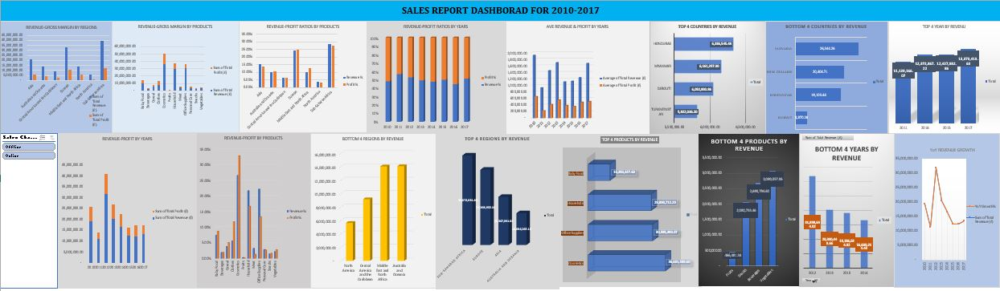
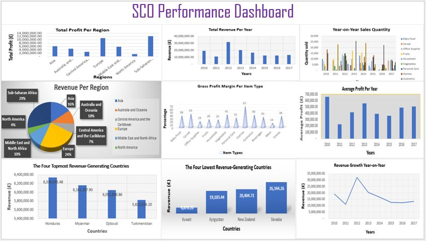

# Project 1

**Title:** [Sylip Sales Report](https://github.com/Oakland23/Oakland23.github.io/blob/main/Sylip_Sales_Analysis.xlsx)

**Tools Used:** Microsoft Excel (data cleansing, text formatting, date splitting, pivot tables, pivot charts, pivot charts analyse, field list, field buttons, chart elements, chart style, chart colour, percentage difference from, rank, sort, value filters, and slicer).

**Project Description:**

**Key Findings:**

**Dashboard Overview:**

# Project 2

**Title:** [SCO Performance Report](https://github.com/Oakland23/Oakland23.github.io/blob/main/SCO.xlsx)

**MS Excel Formula:** [Sales Report-MS Excel Formula](https://github.com/Oakland23/Oakland23.github.io/blob/main/Sales.xcl)

**MS Excel Skills Used:**

**Project Description:**

**Technology Used:**

**Dashboard Overview:**

# Project 3

**Title:** Human Resources

**SQL Code:** [Employee Database-SQL Code](https://github.com/Oakland23/Oakland23.github.io/blob/main/Employee.SQL)

**SQL Skills Used:**

**Project Description:**

**Technology Used:** SQL Server

