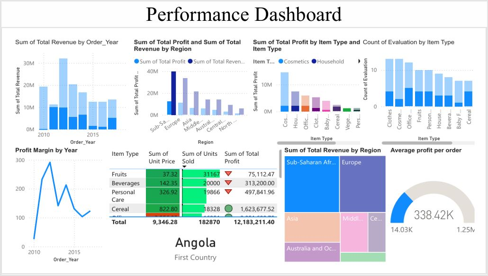

# Project 1

**Title:** [Sylip Sales Report](https://github.com/Oakland23/Oakland23.github.io/blob/main/Sylip_Sales_Analysis.xlsx)

**Tools Used:** MS Excel (text formatting, date splitting, pivot tables, pivot charts, pivot charts analyse, field list, field buttons, chart elements, chart style, chart colour, percentage difference from, rank, sort, value filters, and slicer).

**Project Description:** Creating a dashboard that analytically summarises a company's sales activity over a period using MS Excel's pivot tables

**Key Findings:** 50% gross margin on average year, best performer is cosmetics, and topmost earner is sub-sahara Africa

**Dashboard Overview:**

# Project 2

**Title:** [SCO Performance Report](https://github.com/Oakland23/Oakland23.github.io/blob/main/SCO.xlsx)

**MS Excel Formula:** [Sales Report-MS Excel Formula](https://github.com/Oakland23/Oakland23.github.io/blob/main/Sales.xcl)

**MS Excel Skills Used:** MS Excel (Text formating, tables, charts, colour, formula)

**Project Description:** Creating a dashboard that visualises a company's key sales performance over a period using primarily MS Excel formula

**Key Findings:** Most profitable product is clothes, best earner is Hounduras, and lowest earner is Kuwait

**Dashboard Overview:**

# Project 3

**Title:** Human Resources

**SQL Queries:** [Employee Database-SQL Code](https://github.com/Oakland23/Oakland23.github.io/blob/main/Employee.SQL)

**SQL Skills Used:** ETL, database creation, data import, data interrogation across tables, report export 

**Project Description:** Writing SQL queries that analytically interrogates the make-up of a company's employees database

**Technology Used:** SQL Server

# Project 4

**Title:** [Global Sales Report](https://github.com/Oakland23/Oakland23.github.io/blob/main/PBI_SR.pbix)

**Tools and Skills Used:** Power BI (ETL, get data, measure tools, DAX, table tools, visual builds, format, data drill, shape, colour, and slicer)

**Project Description:** Creating a dashboard that analytically visualises a Multinational's sales report over a period

**Key Findings:** An average profit per order of 441.68k earned, worst performing year 2011 immediately succeeded by best year 2012.

**Dashboard Overview:**

# Project 5

**Title:** Marketing Evaluation

**R Scripts and Code:** [Employee Database-SQL Code](https://github.com/Oakland23/Oakland23.github.io/blob/main/Employee.SQL)

**R Skills Used:** ETL, data import, library, logit, KNN, random forest, decision trees, report export 

**Project Description:** Evaluating various models for predicting subscriptions to the products of a bank

**Technology Used:** R Studion

